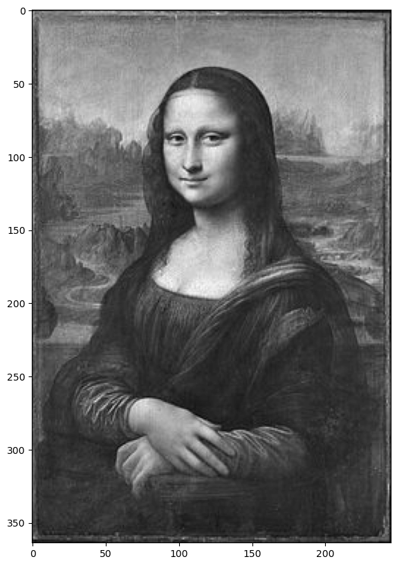
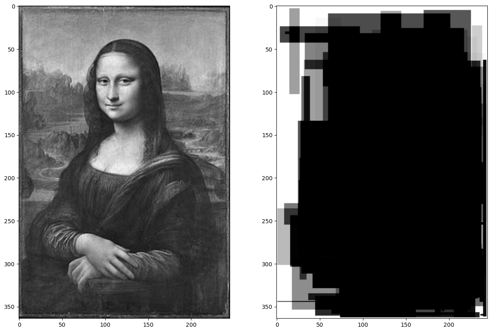
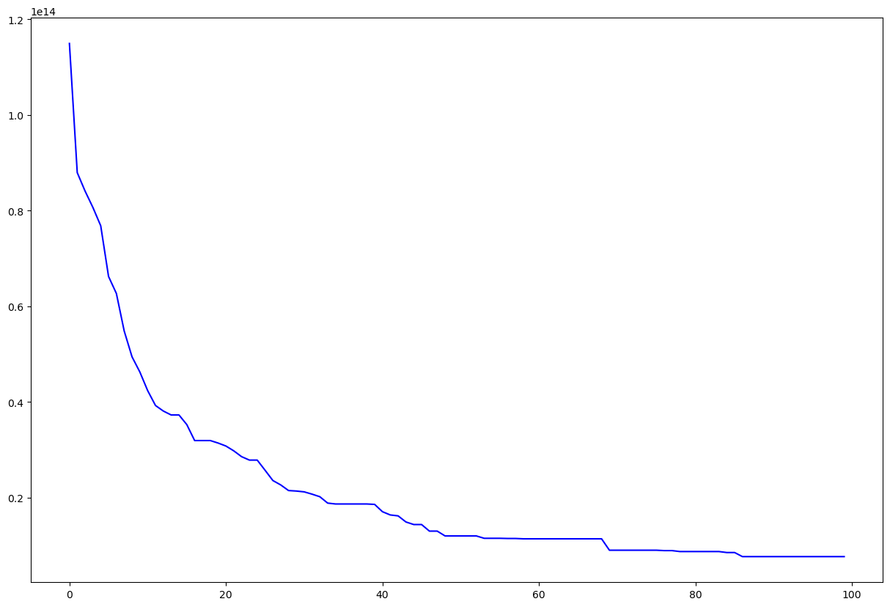
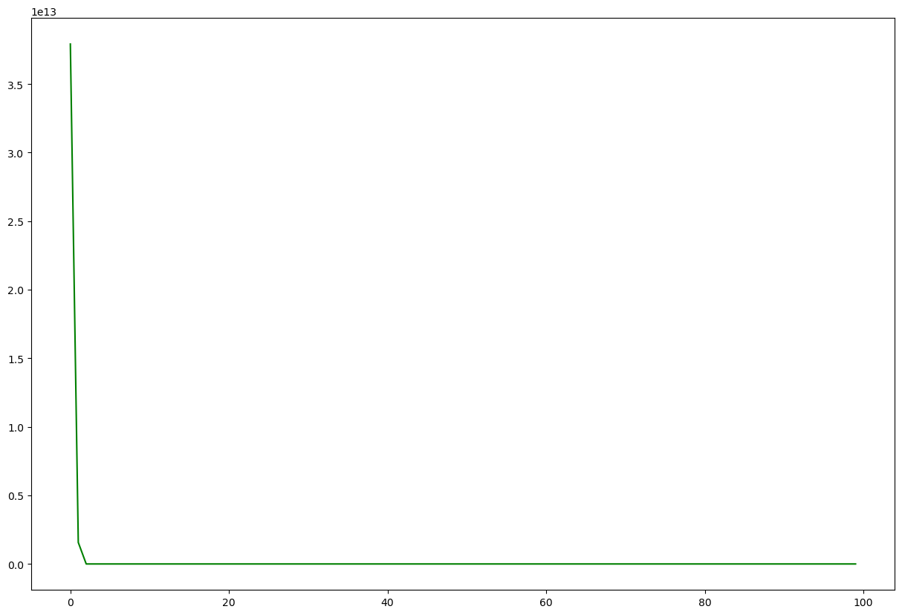
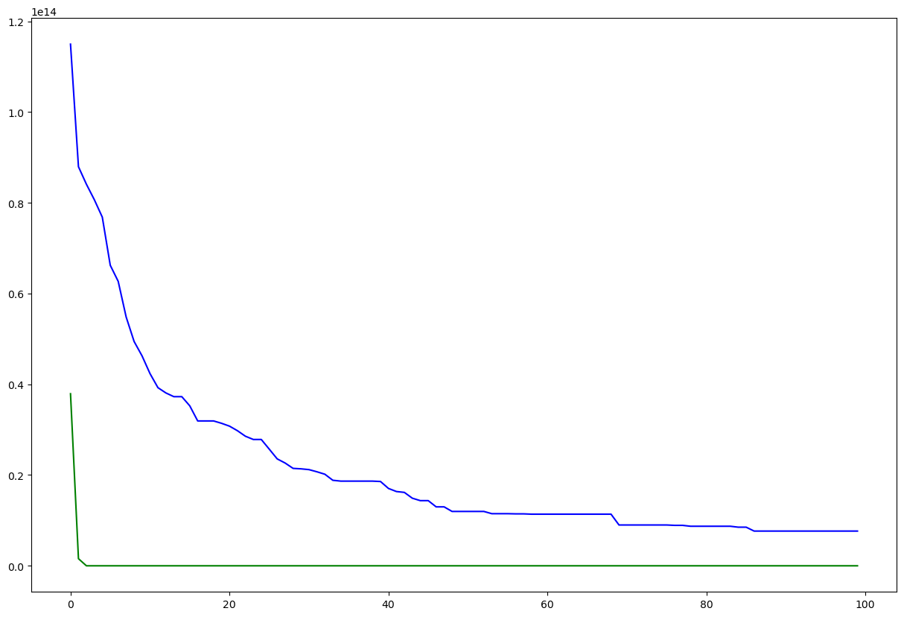
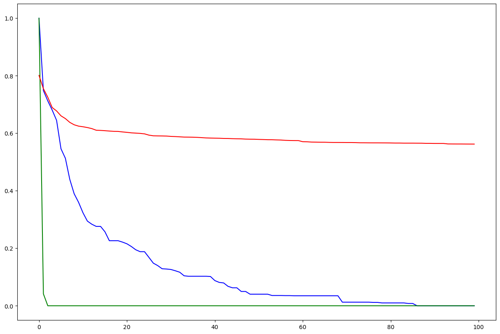
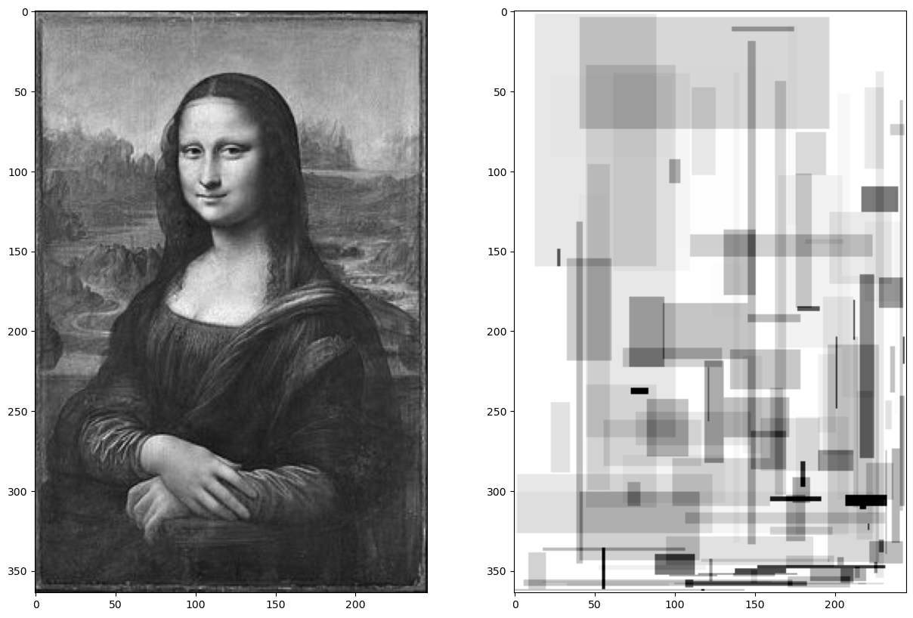
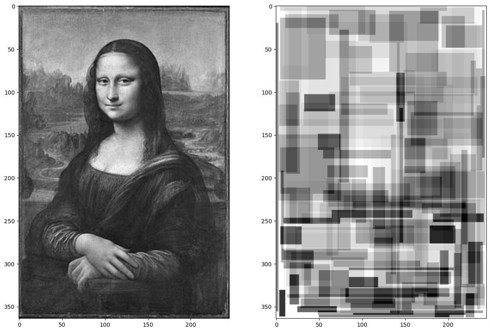
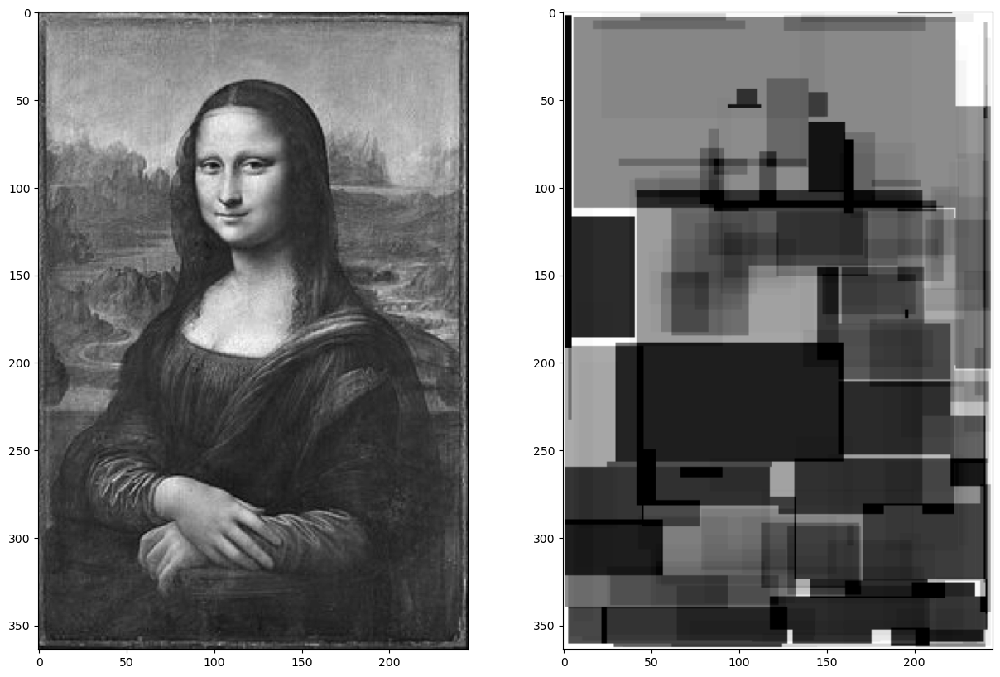

# Práctica 3 (complementaria) - Inteligencia Artificial

## Tema 1: Metaheurísticas para optimización

### Algoritmos genéticos

Miguel A. Gutérrez Naranjo

La Gioconda es un óleo sobre tabla de álamo de 77 × 53 cm, pintado entre 1503 y 1519 por Leonardo da Vinci. En esta práctica vamos a usar algoritmos genéticos para aproximar la siguiente imagen mediante rectángulos en escala de grises.


En primer lugar cargamos las bibliotecas que vamos a necesitar.


```python
# Es posible que no todas estén instaladas. Puede ser necesario reiniciar el kernel tras la instalación
# !pip install imageio
# !pip install scikit-image

# 1.- numpy para la representación matricial
import numpy as np

# 2.- random para generar valores aleatorios
import random

# 3.- PIL e imageio para leer y escribir imágenes.
from PIL import Image
import imageio

# 4.- matplotlib para visualizar imágenes y gráficos.
import matplotlib
from matplotlib import pyplot as plt
matplotlib.rcParams['figure.figsize'] = (15,10) # Para el tamaño de la imagen


# 5.- skimage para comparar imágenes.
from skimage.metrics import structural_similarity as ssim
```

#### De *jpg* a *array* de píxeles en escala de grises

Para empezar, tomamos la imagen que queremos aproximar desde un fichero (en este caso el fichero *gioconda.jpg*) y lo guardamos como una imagen python en escala de grises de 8-bits (256 valores). Para ello usamos las funcionalidades que proporciona la clase `Image` importado de la biblioteca PIL . Para más información consultar: https://pillow.readthedocs.io/en/stable/handbook/concepts.html


```python
imagen_original = 'gioconda.jpg'
imagen_grises = Image.open(imagen_original).convert('L')
plt.imshow(imagen_grises,cmap='gray')
```


    <matplotlib.image.AxesImage at 0x7d4df783d3a0>


    

    


A continuación, transformamos la imagen en una matriz de valores comprendidos entre 0 y 255 mediante la biblioteca `numpy`. Es importante saber que al cambiar el tipo de dato de imagen a matriz se cambian los ejes https://stackoverflow.com/questions/33725237/image-fromarray-changes-size. Llamamos `IM2ARRAY` a la matriz que guarda las intensidades de gris de los píxeles.


```python
IM2ARRAY = np.array(imagen_grises)
IM2ARRAY
```


    array([[ 22,  47,  38, ...,  28,  34,  34],
           [ 87, 131,  97, ...,  26,  31,  20],
           [113, 117,  77, ...,  79,  79,  54],
           ...,
           [ 42, 102,  93, ...,  83,  77,  31],
           [ 16,  31,  17, ...,  69,  64,  31],
           [ 38,  33,  24, ...,  35,  35,  18]], dtype=uint8)


Guardamos el tamaño de la matriz en la variable `im2array_shape` para usarlo como referencia al crear otras matrices.


```python
im2array_shape = IM2ARRAY.shape
im2array_shape
```


    (364, 245)


A continuación fijamos los parámetros del algoritmo genético y demás elementos necesarios que definiremos a continuación con el objetivo de aproximar la imagen anterior usando $150$ rectángulos, que pueden solaparse entre sí, en escala de grises.


```python
# La longitud de los cromosomas
LONGITUD_CROMOSOMA = 150

# Tamaño de la población
TAMANO_POB = 500

# Número de cromosomas que intervienen en cada torneo
NUM_PARTICIPANTES = 50

# Probabilidad de mutación
PROB_MUTACION = 0.1

# Proporción de una generación que se usa como padres
PROP_PADRES = 0.5

# Número de generaciones
GENERACIONES = 10001

# Paso de impresión. Crearemos la imagen correspondiente al mejor cromosoma después de PASO_IMP generaciones
PASO_IMP = 100
```

#### Representación del problema

Usaremos una representación muy básica y se espera que, tras realizar la práctica, el/la estudiante sea capaz de probar con otros polígonos y pasar de la escala de grises a imágenes en color. También es interesante buscar otras definiciones de la función decodifica, que permite generar la imagen a partir del cromosoma, otras funciones *fitness* y otros algoritmos genéticos. 

Para la representación consideraremos que un gen será una tupla de números naturales $(x,y,dx,dy,c)$ que interpretaremos como un rectángulo con extremo superior izquierda $(x,y)$, lados $dx$ y $dy$ y $c\in \{0,1,\dots,255\}$ representa su color (en escala de grises).

### Ejercicio 1
Definir una función `genera_gen()` que, a partir de la variable `im2array_shape`, devuelva una tupla `(x,y,dx,dy,c)`. Hay que tener en cuenta que, fijado el extremo, el rectángulo esté dentro del lienzo y que el color esté en el rango 0-255.


```python
# Solución
def genera_gen():
    pass
```


```python
# Puedes probar la función
genera_gen()

# Posible respuesta:
# (185, 223, 49, 16, 2)
```


    (328, 160, 9, 76, 7)


### Ejercicio 2
Definir una función `genera_cromosoma_()` que devuelva una tupla con tantos genes como determine el parámetro `LONGITUD_CROMOSOMA`


```python
# Solución
def genera_cromosoma_():
    pass
```


```python
# Ejemplo de uso. Guardamos el cromosoma generado en la variable ind_1
ind_1 = genera_cromosoma_()
ind_1[:10], len(ind_1)
```


    (((31, 176, 252, 42, 131),
      (306, 177, 5, 58, 62),
      (36, 221, 118, 12, 246),
      (24, 4, 19, 93, 68),
      (214, 55, 58, 76, 161),
      (127, 203, 5, 7, 101),
      (360, 79, 3, 56, 251),
      (261, 210, 19, 21, 77),
      (109, 170, 54, 23, 132),
      (359, 237, 2, 4, 23)),
     150)


Nótese que estamos representando una imagen con cerca de $90$ mil píxeles usando únicamente $750$ datos.


```python
im2array_shape[0] * im2array_shape[1], LONGITUD_CROMOSOMA*5
```


    (89180, 750)


Para poder interpretar un cromosoma como una imagen, primero generamos una matriz (array) a partir de ese listado de genes. En este caso, las posiciones que no están ocupadas por ningún cuadrado las interpretamos como blanco (valor 255) y en el resto de la posiciones se sumará la intensidad de los rectángulos que las ocupan. La función `decodifica` siguiente crea una matriz con la intensidad de gris de cada píxel a partir de un cromosoma.


```python
def decodifica(ind):
    array_sal = np.zeros(im2array_shape,dtype='uint32')
    array_255 = np.full(im2array_shape,255,dtype='uint32')   
    for (x,y,dx,dy,c) in ind:
        array_sal[x:x+dx,y:y+dy]+= 255 - c
    mini = np.minimum(array_sal,array_255)
    inversa = 255 - mini
    return inversa
```

Podemos ver la matriz generada a partir del cromosoma que hemos creado.


```python
matriz_1 = decodifica(ind_1)
matriz_1
```


    array([[255, 255, 255, ..., 255, 255, 255],
           [255, 255, 255, ..., 255, 255, 255],
           [255, 255, 255, ..., 255, 255, 255],
           ...,
           [255, 255, 255, ...,  18,  18, 255],
           [255, 255, 255, ..., 255, 255, 255],
           [255, 255, 255, ..., 255, 255, 255]], dtype=uint32)


Y la imagen correspondiente a ese cromosoma transformando previamente la matriz. La comparamos con la imagen de la Gioconda en escala de grises.


```python
img_1 = Image.fromarray(matriz_1.astype('uint8'))

f, axarr = plt.subplots(1,2)
axarr[0].imshow(imagen_grises,cmap='gray')
axarr[1].imshow(img_1,cmap='gray')
```


    <matplotlib.image.AxesImage at 0x7d4df7e022a0>


    

    


Obviamente, este cromosoma es una mala aproximación de la imagen original. Vamos a implementar un algoritmo genético que permita encontrar una mejor. 

#### Algoritmo genético

En primer lugar definimos una función que nos permita crear una población inicial de cromosomas.

### Ejercicio 3
Define una función `poblacion_inicial()` que devuelva una lista con tantos cromosomas como determine la variable `TAMANO_POB`


```python
# Solución
def poblacion_inicial():
    pass
```

Para poder seleccionar los mejores individuos de una generación, necesitamos definir una *función fitness*. En este caso se define como la suma de las diferencias (en valor absoluto) pixel a pixel entre la matriz que representa el cromosoma y la matriz que representa la imagen original.


```python
def fitness1(ind):
    return np.sum(np.absolute(decodifica(ind) - IM2ARRAY))
```


```python
# Ejemplo:
fitness1(ind_1) / 1e14
```


    3.17380899896865


A continuación implementamos la selección por torneo. Para evitar repetir cálculos, cuando calculemos el fitness de un cromosoma, lo guardaremos en un diccionario y miraremos si ya ha sido calculado antes cuando necesitemos saber su valor. Las claves del diccionario serán los cromosomas y su valor, el valor de fitness que le corresponda.

### Ejercicio 4
Definir una función `torneo(generacion,dic,fit)` que tome como entrada una generación de cromosomas, un diccionario de pares `cromosoma:fitness` y una función fitness, y devuelva una tupla `(seleccionado,nuevo_dic)` donde `seleccionado` sea un cromosoma de la generación seleccionado por torneo entre `NUM_PARTICIPANTES` participantes y `nuevo_dic` sea el diccionario `dic` al que se le han añadido los pares `cromosoma:fitness` que se hayan calculado en la búsqueda de `seleccionado`.


```python
# Solución
def torneo(generacion, dic, fit):
    pass
```


```python
# Ejemplo de uso
dic = {}
seleccionado_dic = torneo(poblacion_inicial(), dic, fitness1)
seleccionado_dic[1] == dic
```


    True


### Ejercicio 5
Definir una función `selecciona_torneo(generacion, n, dic, fit)` que, además de los parámetros de la función anterior, reciba el número de cromosomas que queremos seleccionar. La salida debe ser una tupla *(seleccion,nuevo_dic)* donde `nuevo_dic` es el diccionario actualizado tras los `n`torneos y `seleccion` es una lista con los cromosomas seleccionados. 


```python
# Solución
def selecciona_torneo(generacion, n, dic, fit):
    pass
```


```python
# Ejemplo de uso
dic = {}
seleccion_dic = selecciona_torneo(poblacion_inicial(), 4, dic, fitness1)
seleccion_dic[1] == dic
```


    True


A continuación definimos el cruce entre cromosomas

### Ejercicio 6
Definir una función `cruza_padres(c1,c2)` que tome dos cromosomas y devuelva una lista con los dos hijos obtenidos mediante la técnica de cruce en un punto.


```python
# Solución
def cruza_padres(c1, c2):
    pass
```

### Ejercicio 7
Definir una función `cruza(padres)` que tome como entrada una lista con un número par de cromosomas y devuelva la lista de hijos obtenida aplicando la función anterior a las sucesivas parejas de padres.


```python
# Solución
def cruza(padres):
    pass
```

### Ejercicio 8
Definir un par funciones `muta_cromosoma_i(ind)` que reciban como entrada un cromosoma. La primera debe obtener un nuevo cromosoma resultado de mutar cada gen con probabilidad `PROB_MUTACION`. La segunda, con probabilidad `PROB_MUTACION` mutará sólo uno de sus genes.


```python
# Solución
# Mutar cada gen con probabilidad PROB_MUTACION
def muta_cromosoma_1(ind):
    pass

# Mutar un sólo gen elegido al azar con probabilidad PROB_MUTACION
def muta_cromosoma_2(ind):
    pass
```

### Ejercicio 9
Definir una función `muta(generacion, mc)` que reciba como entrada la lista de cromosomas y una de las funciones anteriores, y devuelva el resultado de aplicarla a cada cromosoma de la lista.


```python
# Solución
def muta(generacion, mc):
    pass
```

A continuación definimos el algoritmo que permite encontrar una nueva generación a partir de una dada.

### Ejercicio 10
Definir una función `nueva_poblacion(generacion, n_padres, n_directos, dic, fit, mc)` que reciba como entrada:
* *generacion* es una población de cromosomas
* *n_padres* es un número que determina cuántos cromosomas seleccionar por torneo para ser padres
* *n_directos* es un número que determina cuántos cromosomas seleccionar por torneo para pasar directamente a la siguiente generación.
* *dic* es un diccionario de pares *cromosoma:fitness*
* *fit* una función fitness
* *mc* una función de mutación

La función debe seleccionar un conjunto de cromosomas para ser padres y otro para pasar directamente a la siguiente generación. A partir de los padres se debe generar un conjunto de hijos por cruce. La función debe devolver una tupla `(nueva_gen,nuevo_dic)` donde `nueva_gen` es una lista de cromosomas con los que pasan directamente más el resultado de aplicar la función de mutación a los hijos.


```python
# Solución
def nueva_poblacion(generacion, n_padres, n_directos, dic, fit, mc):
    pass
```

Por último definimos el algoritmo genético en el que se genera una población inicial y se van creando nuevas generaciones usando las funciones anteriores. Además, cada *PASO_IMP* imprimimos la imagen correspondiente al mejor cromosoma de esa generación. La función devuelve la lista de los valores *fitness* de estos cromosomas, para poder luego representar gráficamente la evolución de la función a lo largo de las `GENERACIONES`, y el último de ellos.


```python
def algoritmo_genetico(fit, mc):
    generacion = poblacion_inicial()
    dic = {}
    n_padres = round(TAMANO_POB * PROP_PADRES)
    n_padres = (n_padres if n_padres%2==0 else n_padres-1)
    n_directos = TAMANO_POB - n_padres
    val_mejores = []
    for counter in range(GENERACIONES):
        if counter%PASO_IMP == 0:
            print(counter)
            min = float('inf')
            for ind in generacion:
                if ind in dic:
                    f_ind = dic[ind]
                else:
                    f_ind = fit(ind)
                if f_ind < min:
                    mejor = ind
                    min = f_ind
            img_mejor = decodifica(mejor).astype('uint8')
            imageio.imwrite('ga_{:>08}.jpg'.format(counter//PASO_IMP),img_mejor)
            val_mejores.append(min)
        else:
            print('.',end='')
        generacion, dic = nueva_poblacion(generacion, n_padres, n_directos, dic, fit, mc)
    return val_mejores, mejor
```


```python
sal_ag1 = algoritmo_genetico(fitness1, muta_cromosoma_1)
```

    0
    


```python
plt.plot(sal_ag1[0][1:], color = "b")
plt.show()
```


    

    


```python
sal_ag2 = algoritmo_genetico(fitness1, muta_cromosoma_2)
```

    0
    100
    200
    300
    400
    500
    600
    700
    800
    900
    1000
    1100
    1200
    1300
    1400
    1500
    1600
    1700
    1800
    1900
    2000
    2100
    2200
    2300
    2400
    2500
    2600
    2700
    2800
    2900
    3000
    3100
    3200
    3300
    3400
    3500
    3600
    3700
    3800
    3900
    4000
    4100
    4200
    4300
    4400
    4500
    4600
    4700
    4800
    4900
    5000
    5100
    5200
    5300
    5400
    5500
    5600
    5700
    5800
    5900
    6000
    6100
    6200
    6300
    6400
    6500
    6600
    6700
    6800
    6900
    7000
    7100
    7200
    7300
    7400
    7500
    7600
    7700
    7800
    7900
    8000
    8100
    8200
    8300
    8400
    8500
    8600
    8700
    8800
    8900
    9000
    9100
    9200
    9300
    9400
    9500
    9600
    9700
    9800
    9900
    10000
    


```python
plt.plot(sal_ag2[0][1:], color = "g")
plt.show()
```


    

    


```python
sal_ag1[0][1], sal_ag1[0][-1], sal_ag2[0][1], sal_ag2[0][-1]
```


    (91147803553825, 4157539849507, 81668812232985, 8169582)


```python
plt.plot(sal_ag1[0][1:], color = "b")
plt.plot(sal_ag2[0][1:], color = "g")
plt.show()
```


    

    


### Ejercicio 11
La función fitness definida anteriormente es fácil de implementar, pero no es la más apropiada para comparar imágenes. Vamos a considerar otra medida basada en la similaridad estructural para comparar imágenes utilizando la función `structural_similarity` de la biblioteca `skimage.metrics` (importada como `ssim`). Para más información consultar: https://scikit-image.org/docs/0.25.x/api/skimage.metrics.html#skimage.metrics.structural_similarity


```python
def fitness2(ind):
    dec = decodifica(ind)
    return 1 - ssim(IM2ARRAY, dec, data_range=dec.max() - dec.min())

# Ejemplo:
fitness2(ind_1)
```


    0.9878615912126089


```python
sal_ag3 = algoritmo_genetico(fitness2, muta_cromosoma_2)
```

    0
    100
    200
    300
    400
    500
    600
    700
    800
    900
    1000
    1100
    1200
    1300
    1400
    1500
    1600
    1700
    1800
    1900
    2000
    2100
    2200
    2300
    2400
    2500
    2600
    2700
    2800
    2900
    3000
    3100
    3200
    3300
    3400
    3500
    3600
    3700
    3800
    3900
    4000
    4100
    4200
    4300
    4400
    4500
    4600
    4700
    4800
    4900
    5000
    5100
    5200
    5300
    5400
    5500
    5600
    5700
    5800
    5900
    6000
    6100
    6200
    6300
    6400
    6500
    6600
    6700
    6800
    6900
    7000
    7100
    7200
    7300
    7400
    7500
    7600
    7700
    7800
    7900
    8000
    8100
    8200
    8300
    8400
    8500
    8600
    8700
    8800
    8900
    9000
    9100
    9200
    9300
    9400
    9500
    9600
    9700
    9800
    9900
    10000
    


```python

M1 = max(sal_ag1[0][1:])
m1 = min(sal_ag1[0][1:])

M2 = max(sal_ag2[0][1:])
m2 = min(sal_ag2[0][1:])

plt.plot([(x - m1) / (M1 - m1) for x in sal_ag1[0][1:]], color = "b")
plt.plot([(x - m2) / (M2 - m2) for x in sal_ag2[0][1:]], color = "g")
plt.plot(sal_ag3[0][1:], color = "r")
plt.show()
```


    

    


```python
indM1 = sal_ag1[1]
matrizM1 = decodifica(indM1)
imgM1 = Image.fromarray(matrizM1.astype('uint8'))

f, axarr = plt.subplots(1,2)
axarr[0].imshow(imagen_grises,cmap='gray')
axarr[1].imshow(imgM1,cmap='gray')
```


    <matplotlib.image.AxesImage at 0x7a5790f44440>


    

    


```python
indM2 = sal_ag2[1]
matrizM2 = decodifica(indM2)
imgM2 = Image.fromarray(matrizM2.astype('uint8'))

f, axarr = plt.subplots(1,2)
axarr[0].imshow(imagen_grises,cmap='gray')
axarr[1].imshow(imgM2,cmap='gray')
```


    <matplotlib.image.AxesImage at 0x7a577bc032f0>


    

    


```python
indM3 = sal_ag3[1]
matrizM3 = decodifica(indM3)
imgM3 = Image.fromarray(matrizM3.astype('uint8'))

f, axarr = plt.subplots(1,2)
axarr[0].imshow(imagen_grises,cmap='gray')
axarr[1].imshow(imgM3,cmap='gray')
```


    <matplotlib.image.AxesImage at 0x7a579768d1c0>


    

    


```python
fitness1(indM1) / 1e14 , fitness1(indM2) / 1e14 , fitness1(indM3) / 1e14, fitness2(indM1), fitness2(indM2) , fitness2(indM3)

```


    (0.07653642944617,
     8.11393e-08,
     1.52415505455699,
     0.8067055019731366,
     0.8671795453266959,
     0.5622576060843517)

